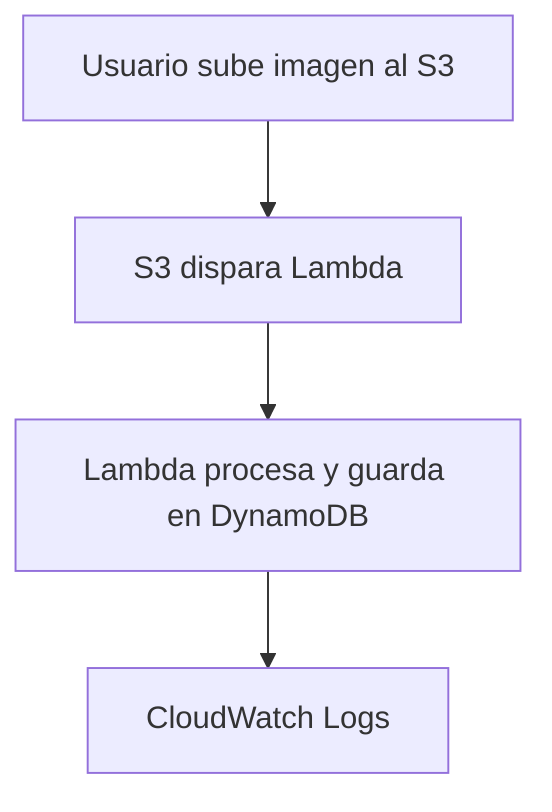

# Proyecto: Procesamiento de Imágenes con AWS Lambda, DynamoDB y FastAPI

Este proyecto implementa una arquitectura serverless y multirregional en AWS, diseñada para procesar imágenes ambientales mediante técnicas de visión artificial. El sistema detecta y elimina rastros humanos (como basura u objetos artificiales) y registra los resultados en una base de datos DynamoDB. Está orientado a apoyar a ONGs, municipalidades y entidades ecológicas que monitorean la conservación del medio ambiente.

---

## 🧩 Arquitectura 

