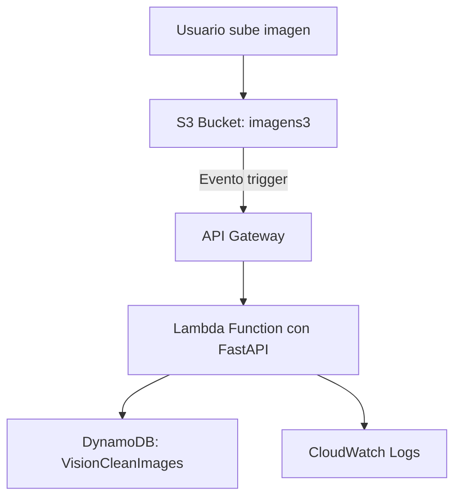

# Proyecto: Procesamiento de Imágenes con AWS Lambda, DynamoDB y FastAPI

El flujo comienza cuando un usuario sube una imagen a un bucket de Amazon S3. Este evento desencadena una invocación a través de API Gateway. La función Lambda ejecuta un modelo de visión artificial encargado de detectar y eliminar rastros humanos (como basura u objetos artificiales) en las imágenes. Los resultados procesados se almacenan en una tabla de Amazon DynamoDB para su posterior análisis o consulta.

Este sistema está diseñado para apoyar a ONGs, municipalidades y entidades ecológicas en la conservación del medio ambiente, facilitando la supervisión y limpieza digital de entornos naturales mediante inteligencia artificial y recursos cloud.

## Arquitectura 

